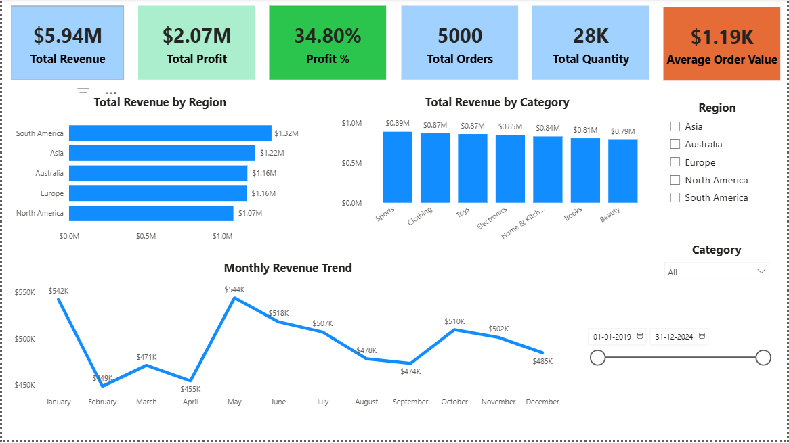
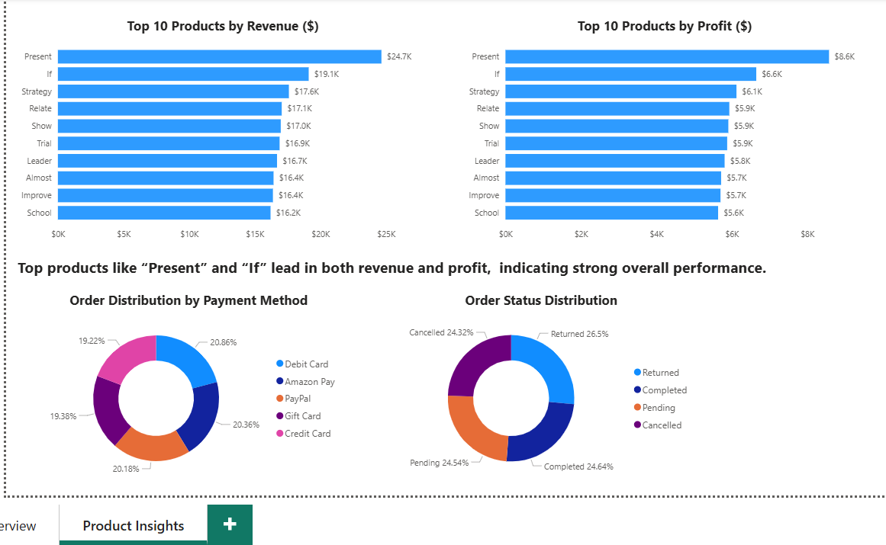

# Sales Performance Analysis Dashboard (Power BI)

## 📊 Overview

This project analyzes sales data to uncover insights related to revenue, profit, customer behavior, and operational performance.

## 🛠 Tools Used

* Power BI
* Excel

## 📌 Key KPIs

* Total Revenue
* Total Profit
* Profit %
* Total Orders
* Average Order Value

## 📈 Key Insights

* South America leads in revenue generation
* Peak sales observed in May, lowest in April
* Top products drive both revenue and profit consistently
* High return and cancellation rates indicate improvement areas

## 📷 Dashboard Preview

## 🚀 Outcome

This project demonstrates end-to-end data analysis including data cleaning, modeling, visualization, and business insight generation.
